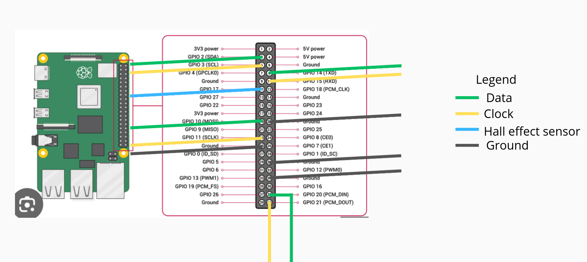

# Dans ce dossier, vous trouverez tout ce qu'il faut savoir pour faire fonctionner les LEDs sur le système

## Sommaire
- [Partie 1 : Connexion avec la Raspberry Pi](#partie-1--connexion-avec-la-raspberry-pi)
- [Partie 2 : Gestion des LEDs](#partie-2--gestion-des-leds)
  - [Interfaces SPI](#interfaces-spi)
  - [Remarques](#remarques)
- [Partie 3 : Comment setup une Raspberry Pi toute neuve](#partie-3--comment-setup-une-raspberry-pi-toute-neuve)

## Partie 1 : Connexion avec la Raspberry Pi

La Raspberry Pi est alimentée via le 5 V provenant du slip ring, lui-même relié à la prise secteur. Cette même alimentation alimente également les LEDs via des connecteurs situés aux quatre coins de la roue.

Pour lancer le programme sur la Raspberry Pi, on se connecte en SSH depuis un PC connecté au même réseau. Pour la première connexion, nous conseillons d’utiliser l’interface graphique de la Raspberry Pi afin de configurer les paramètres réseau (nom du réseau et mot de passe) à l’aide d’un clavier, d’une souris et d’un écran connecté en HDMI à la carte.  
Notez également l’adresse IP de la Raspberry Pi une fois connectée au réseau, afin de configurer la liaison SSH.

### Nom d’utilisateur et mot de passe
Le nom d’utilisateur et le mot de passe de cette Raspberry Pi sont respectivement :  
**nom d’utilisateur : `se`**  
**mot de passe : `se`**

Une fois connecté en SSH, placez-vous dans le répertoire de travail et activez l’environnement virtuel Python dans lequel sont installées les bibliothèques nécessaires :

```bash
cd pr/
source venv/bin/activate
```

Notez qu’à chaque redémarrage de la carte, l’environnement virtuel `venv` doit être réactivé.

Il ne reste plus qu’à lancer le programme de votre choix. Ici, nous utiliserons `logon.py` :

```bash
python3 logon.py
```

## Partie 2 : Gestion des LEDs

### Interfaces SPI

Nous avons besoin de **quatre interfaces SPI indépendantes**, qui doivent être présentes dans `/dev` afin d’être détectées par la bibliothèque `dotstar`.  
Pour leur mise en place, voir la section [Partie 3 : Comment setup une Raspberry Pi toute neuve](#partie-3--comment-setup-une-raspberry-pi-toute-neuve).



Dans notre programme `logon.py`, les bandeaux de LEDs sont déclarés comme suit, ce qui correspond aux connexions GPIO visibles sur l’image ci-dessus :

```python
# East
strip_e = adafruit_dotstar.DotStar(board.D3, board.D2, NUM_LEDS, brightness=0.1, auto_write=False)
# North
strip_n = adafruit_dotstar.DotStar(board.D11, board.D10, NUM_LEDS, brightness=0.1, auto_write=False)
# West
strip_w = adafruit_dotstar.DotStar(board.D21, board.D20, NUM_LEDS, brightness=0.1, auto_write=False)
# South
strip_s = adafruit_dotstar.DotStar(board.D15, board.D14, NUM_LEDS, brightness=0.1, auto_write=False)
```

Lors du câblage, il est important de vérifier quels GPIO sont connectés à quels bandeaux de LEDs, par exemple à l’aide d’un programme qui allume chaque bandeau avec une couleur différente afin de les identifier. Des erreurs ou inversions sont possibles.

### Remarques

- Le temps entre chaque itération de la boucle (ce qui définit la fréquence de rafraîchissement des LEDs) n’est modifiable que dans le programme, via la variable `dt`.
- Il n’existe pas de moyen direct d’éteindre les LEDs via le code, à part afficher une image noire ou couper puis rétablir l’alimentation électrique.
- Plusieurs améliorations du code sont possibles :
  - augmenter le pas angulaire à 2° ;
  - ne rafraîchir qu’un seul bandeau de LEDs à la fois au lieu des quatre ;
  - ajouter un `try/except` pour éteindre toutes les LEDs lors d’une interruption du programme via `KeyboardInterrupt` ;
  - créer une interface permettant de faire varier dynamiquement la fréquence de rafraîchissement des LEDs.

## Partie 3 : Comment setup une Raspberry Pi toute neuve

Dans le cas où l’OS doit être réinstallé sur la Raspberry Pi, ou en cas de changement de carte, cette partie explique comment tout configurer afin de faire fonctionner le programme.

Tout d’abord, il faut activer les interfaces SPI nécessaires. Certaines combinaisons d’interfaces SPI ne fonctionnent pas ensemble ; nous avons dû procéder par essais/erreurs afin de trouver une combinaison de quatre interfaces fonctionnelles.

Pour les activer, on modifie directement le fichier `config.txt`. Selon la version de l’OS installée, son emplacement peut varier :

```bash
sudo nano /boot/firmware/config.txt
```

À la fin du fichier, ajouter les lignes suivantes :

```ini
dtoverlay=spi0-1cs
dtoverlay=spi1-1cs
dtoverlay=spi3-1cs
dtoverlay=spi5-1cs
```

Redémarrer ensuite la carte :

```bash
sudo reboot
```

On peut vérifier que les quatre interfaces SPI sont bien visibles dans le répertoire `/dev` :

```bash
ls /dev/spi*
```

Ensuite, créer un dossier de travail, mettre le système à jour et installer Python :

```bash
sudo apt update
sudo apt upgrade -y
sudo apt install -y python3 python3-pip python3-venv python3-dev
```

Enfin, créer l’environnement virtuel Python et installer les bibliothèques nécessaires :

```bash
mkdir pr
cd pr/
python3 -m venv venv
source venv/bin/activate
pip install --upgrade pip
pip install adafruit-circuitpython-dotstar
pip install adafruit-blinka
pip install pillow
```
